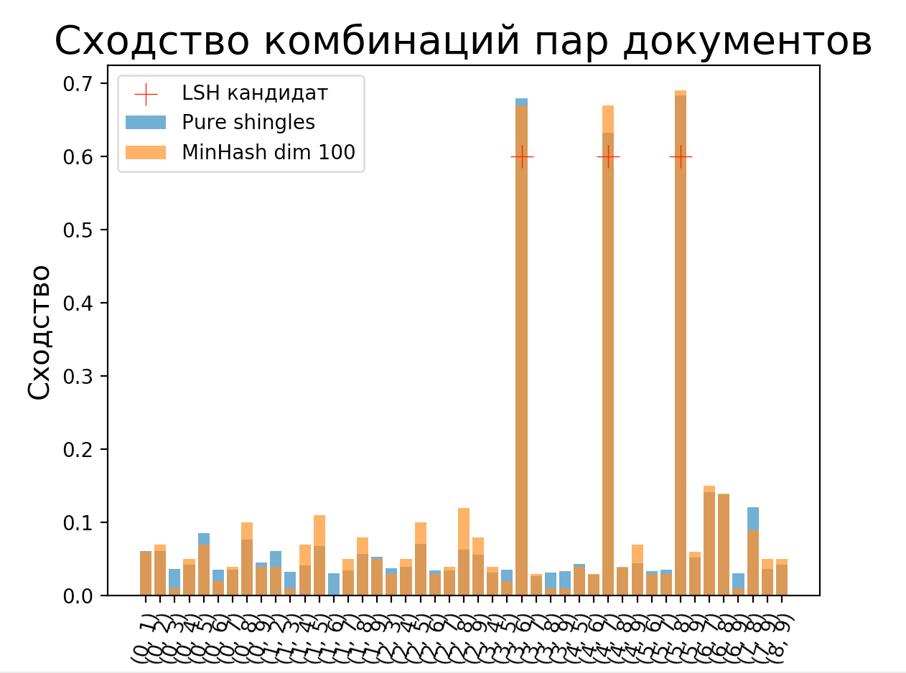
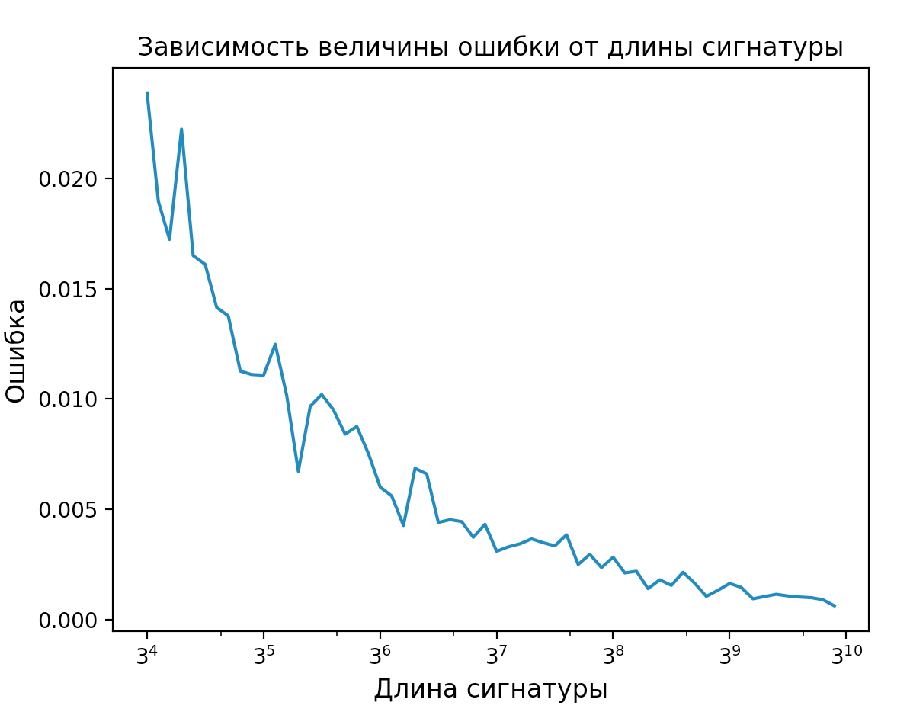
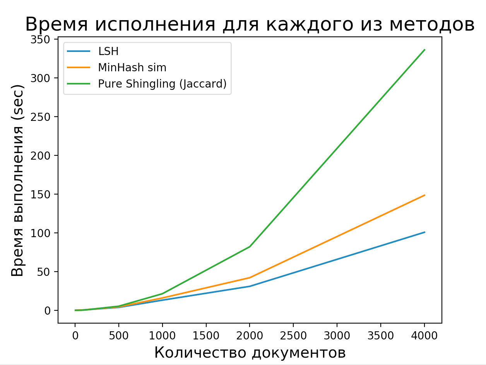

# Реализация LSH

Перед разбором алгоритма предлагаем пройти инструкцию по настройке `python` и библиотек для дальнейшего запуска приложения.

### Создайте виртуальное окружение (Python >= 3.8.1)

```
python -m venv venv
```

### Активируйте виртуальное окружение

```
source venv/bin/activate
```

### Загрузите нужные библиотеки

```
pip install -r requirements.txt
```

### Результаты 

Реализация содержит сравнение документов с использованием Jaccard similarity наборов шинглов и signature similarity сигнатур, которое является приближением предыдущей меры сходства. `Estimation.py` содержит сравнение трех заявленных подходов для этой задачи с точки зрения точности и временной сложности.

#### Проверка схожести пар документов

На схожесть были проверены все возможные комбинации пар из 9 документов из набора данных BBC. Эти 9 документов копируют 6 исходных документов, а остальные 3 являются слегка модифицированными версиями. Это было сделано для оценки, сможет ли различные методы обнаруживать плагиат в слишком похожих документах.

На рисунке ниже мы можем увидеть, насколько похожими являются каждая пара документов в зависимости от используемого метрики. Синие столбцы показывают Jaccard similarity для хешированных наборов шинглов, а оранжевые столбцы показывают схожесть сигнатур после MinHashing с длиной сигнатуры 100. В этом эксперименте использовались 5-шинглы, и длина документа была ограничена 500 символами. Красные крестики в рисунке ниже указывают на пары, которые считаются кандидатами нашим алгоритмом LSH, где порог был равен 0.6.



Как видно, схожесть сигнатур(оранжевые столбцы) и Jaccard similarity (в синих столбцах) хорошо коррелируют друг с другом, и три пары кандидатов, найденные LSH, действительно показывают высокую схожесть. Среднее значение разницы по всем парам для этого конкретного запуска составляет: -0.00243 с дисперсией 0.000379. Среднее значение абсолютного значения ошибки составляет 0.0153, что допускаем приемлемым для данной реализации. Кроме того, было замечено, что результат зависит от случайной seed точки и инициализации параметров. Параметры могут быть меняться, например, в зависимости от длины сигнатуры.

#### Оценка приближения схожести относительно длины сигнатуры

Было исследовано, как схожесть коррелируется с изменением длины сигнатуры, был построен график среднего значения абсолютного значения остатков ошибок при увеличении длина сигнатуры, над всеми возможными комбинациями 9 документов, используемых ранее. 

График представлен ниже и, как видно, ошибка уменьшается при увеличении длины подписи. Недостатком использования слишком длинных сигнатур является то, что это увеличивает вероятность ложноположительных результатов в методе lsh, так как мы требуем только того, чтобы одна полоска совпадала во всех документах для того, чтобы они считались похожими.



#### Масштабируемость

Масштабируемость была оценена путем построения графика зависимости времени выполнения (секунд) от количества обработанных документов для трех разных алгоритмов. Как можно заметить на рисунке ниже, время выполнения с использованием signature similarity для измерения схожести (сравнение всех комбинаций наборов шинглов и матрицы сигнатур) увеличивается при увеличении количества документов. LSH масштабируется лучше при добавлении большего количества документов. Каждый алгоритм был использован для поиска пар похожих документов с 5-шинглами и порогом 0.6. Длина сигнатуры была равна 100, а максимальное количество символов документа было ограничено 500.



Это увеличение времени выполнения ожидаемо, так как signature similarity имеет сложность O(const * n^2), в то время как LSH имеет сложность O(const * n), где n - количество документов, предполагая, что другие расчеты занимают константное время, и все документы недостаточно похожи друг на друга, чтобы считаться кандидатскими парами.
